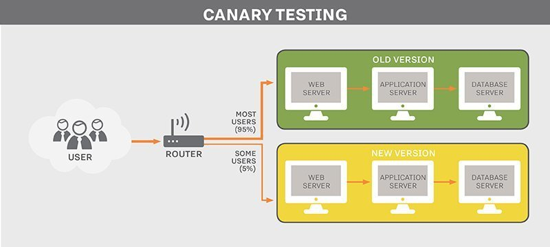

<!-- class: invert -->

<style scoped>
  h1 {
    text-align: left
  }
</style>

# Braving **Feature Flags**

by Raphael D. Pinheiro
**@raphaklaus**

---

# Some context

Some years ago software and hardware engineers faced a problem somehow like this:

> How can I deploy a new software version in a way that I minimize the bug risk and downtime?
    - some sensible dev

---

# Blue-green deployment
<style>
img[alt~="center"] {
  display: block;
  margin: 0 auto;
}
</style>


---

## 👍 Mitigate risk by having two environments whereby one can quickly rollback in case of failure
## 👍 Smaller downtimes
## 👎 Uses `All or None` strategy that redirects abruptly all traffic to the new version
## 👎 Depend on ops team in many aspects
## 👎 Duplicated environment
___

# Canary deployment



---

## 👍 Mitigate risk by having two environments whereby one can quickly rollback in case of failure
## 👍 Smaller downtimes
## 👍 Ability to smartly route a percentage of the traffic to either green or blue environments, reducing even more the risk of a system fall-down
## 👎 Depend on ops team in many aspects
## 👎 Duplicated environment

---

# Hmm, maybe there is a simpler way to go about this...

---
<style>
img[alt~="center"] {
  display: block;
  margin: 0 auto;
}
</style>


---

# What?

Feature flags are mechanisms that control the flow of a system according to any relevant criteria.

By its core definition, it enables faster and safer feature rollouts by controlling which group of users are going to see that new feature change.

Ultimately, that will empower us to do Continuous Delivery.

---

# What?

> Feature flags give a software organization the power to reduce risk, iterate quicker, and gain more control.
    - featureflags.io

Think about it as a Canary release method on steroids.

---

# Why?

* Because it let you release things in a safe and granular way
  * `Release feat-xyz to 5% of the users`
  * `Release feat-xyz to users of just X city`
* Because in an event of failure, just turn off the flag to go back to the working state. No rebuilds, no redeploys.
* Because the stakeholders don't need to wait weeks to see one change live. Ship fast!
* Because A/B testing is also powerful.

---

# How?

* By using a feature flagging service like [LaunchDarkly](launchdarkly.com)
* By creating your new features/changes behind a flag
* By having just one long-lived branch: `master`
  * `develop` doesn't make sense here
* By creating smart user segmentation so you can target your changes to a very specific group

---

# How?

* By stablishing a culture of writing tests
* By having good monitoring tools
* By listening to the support engineering team's feedback
* By ensuring we have an amazing CI
  * Compile
  * Solid types and contracts
  * Static analysis
  * Tests

---

# How?

## Talk is cheap, show me the code

```elixir
  #...  
  case flag("new-auth-system", user) do
    true -> use_new_auth_system()
    _ -> use_old_auth_system()
  end
```

---

# When?

Rule of thumb: Whenever the code you are changing might affect the user experience. That simple.

---

# What to expect

* Ship often
* Faster feedback
* Safer deploys
* Learn how to operate the FF service (LaunchDarkly in our case)
* Enlarge the ownership level of the developer. One task is done when it works on production for 100% of the userbase rather than when it is merged

---

# What to expect

* No more "release days"
* QA role will have to be repurposed.
  * Staging environment doesn't exist here
  * We will perform all validations and tests in the best environment ever: **production**
  * Give QA access over our metrics and other tools
* Write more and meaningful tests
* Open channel with support engineering team

---

# Deployment strategies

## Gradual rollout

1) You start by saying: `Ok, show this feature just to 10% of the userbase`
2) Communicate that on the relevant channels
3) Check the logs and listen to support feedback
4) If all good, start to ramp it up gradually
  4.1 If an error is found, turn off the FF to go back to the working state
  4.2 If all is good during a reasonable timespan, remove the FF from the code

---

# Deployment strategies

## Ring rollout

1) Deploy to a small group like QA team + few non-sensible users or opted-in beta users
2) Expand this group to broader audience composed by the previous group + 10% of userbase
3) Continue expanding until needed
4) The main difference here is that we can include as many user groups as we want before hitting the real userbase.

---

# Wrapping up

Sooner or later, issues on production are inevitable. But we can make them speak more quietly or shut them up at any moment if we work properly using Feature Flags.

---

<style scoped>
  h1 {
    text-align: center
  }
</style>

# Questions? 🤔